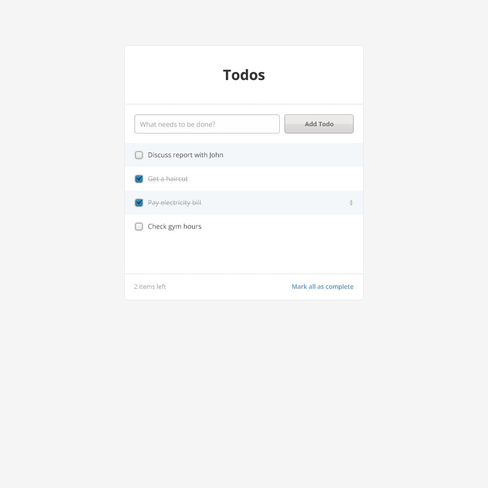

# Hiotlabs Take Home Task

Thank you for taking the time to do our technical test. This document describes the details of the test, but if you have any further questions or something isn't clear - don't hesitate to reach out.

## The mission

The task is to build a todo application - which allows the user to create, read, update and delete items in their todo list. The assignment consists of the following parts;

* A NodeJS backend which provides a REST API for performing the above operations.
* [Fullstack Developers Only] A simple web frontend designed according to the PNG provided below.
* [Backend Developers Only] A mechanism to test the API 

Feel free to spend as much or as little time on the exercise as you like as long as the requirements have been met. However, we understand people have busy lives and would guide you to spend no more than 3-4 hours on a submission. You are welcome to make tech decisions to keep development time down (such as using a simple storage system instead of MongoDB), as long as you can describe how you would do things differently if you had more time to build a fleshed out solution (please mention this in an attached README).

## Backend / API (All Applicants)

The backend / server should meet the following technical requirements;

* A NodeJS application using any web-framework you are comfortable with. 
* Containerised using Docker, along with any dependencies you use alongside it.

The backend should;

* Provide a REST api that supports create, read, update and delete operation on todo list entries. 
* Support muiltple todo lists, referenced by a unique ID
* No user authentication is required - it is okay that any user can operate on any todo list. 

## Frontend (All Applicants)

The frontend application should be built using [React](http://facebook.github.io/react/) or equivalent. As long as you can motivate your choice of frameworks we're fine with it. You are welcome to use any additional libraries as you see fit.

The application should be designed around the following image, although - we are happy for you to iterate on and tweak the design if you like (we know its a bit boring), but it is not necessary. We are not looking for a per-pixel match, consider it a mock-up not a pre-design.

## Evaluation Criteria

It's up to you to set the scope of the assessment and motivate your design choices. You will be evaluated on the following criteria.

**Backend**
* Implements a clear and concise API
* Can be run quickly and easily using Docker

**Frontend**
* Your application follows the general layout/design of the attached PNG
* Your application is performant and reacts quicly to user input
* You ***do not*** need to make your solution responsive, but it should function on both mobile and desktop

**All Parts**
* You are able to justify and motivate your design choices in a follow-up meeting
* You can explain what you would do differently in a finished product

## Delivery

The application should be delivered as a `git` repository, preferably hosted on GitHub (https://github.com/).

## Follow up

During the follow up interview we'll go through the different aspects of the application and discuss

* Client side application structure and used libraries and their behavior and implementation
* Look and feel of client side application
* Server side application structure and frameworks
* API design
* Design choices and their advantages and disadvantages

Good luck!

